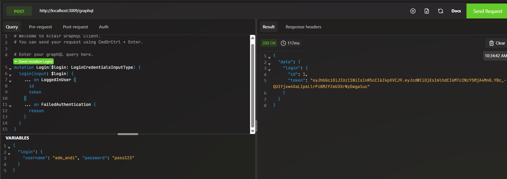
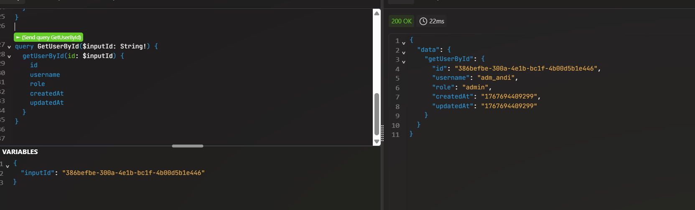

## Setup

## Prerequisites
- tested with Node.js v24.10.0

## Setup
After cloning this project, since the node_modules folder is part of .gitignore, these are the needed dependencies:
```bash
npm install express --save
npm install graphql --save
npm install graphql-http
npm install jsonwebtoken
npm install --save sequelize
npm install --save sqlite3
npm install --save-dev sequelize-cli
npm install @faker-js/faker
npm install bcryptjs
npm install --save-dev jest
npm install supertest
```
To run in the development mode, included in package.json:
- macOS/ linux/ windows:
```bash
npm run start
```
Also to check the database, install DB Browser SQLite (https://sqlitebrowser.org)

To run in the test mode:
- macOS/ linux
```bash
npm run test:watch
```
- windows
```bash
npm run test:windows:watch
```

To delete the database and run existing migrations and seeds:
- macOS/ linux
```bash
chmod +x refresh_macos_linux.sh
./refresh_macos_linux.sh
```
- windows:
```bash
.\refresh_windows.bat
```

## Further info

These are the steps to fully reconstruct this project's setup if someone would like to go through this project's main structure and not just clone it (actual steps followed throughout the semester, since the explanations below are based on the notes taken during labs):
```bash
npm init -y # yes to all default configs
```
```bash
npm run start # SAU npm start
```
```javascript
"scripts": {
    "start": "node index.js",
}
```
- searches in in node_modules for the express instance:
```javascript
const express = require('express');
```
- for hot reload we use nodemon in order to watch for changes, no need to install it using npm, since this npx command won't install it as a project dependency, but rather as a dependency in the global env
```bash
npx nodemon index.js
```

- instead of always running the program in development mode using
```bash
npx nodemon index.js
```

an alternative version would be:
```bash
npm run dev
```

this command was defined inside package.json:
```javascript
"scripts": {
    "start": "node index.js",
    "dev": "npx nodemon index.js"
}
```

- irrelevant detail since the project will include graphql, however for the http-request assignment we couldn't use postman to verify requests (because of the restrictions imposed by this tool), therefore we chose to use bruno instead
- graphql: openingCrawl, queries, mutations, union type, subscriptions
- we won't be using schema definition language
- thanks to the graphql-http module we dont need bruno anymore
- jwt is needed when identifying a stateless user (a token is always sent for security reasons)
- when connecting to the database through an orm, the operations will be asynchronous and handled with async/await via promises

- for creating a persistent database using sequelize-cli:
```bash
npx sequelize-cli init
touch db_ai_prompt_dir.sqlite
```

- for generating a migration for the Users table, run:
```bash
npx sequelize-cli migration:generate --name create-users
```
  - edit this migration file to define the structure of the Users table
  - after that, run:

```bash
npx sequelize-cli db:migrate
```

- for undoing migrations:
```bash
npx sequelize-cli db:migrate:undo
```

- for creating the first seed - its sole purpose is to populate the database with random values:
```bash
npx sequelize-cli seed:generate --name users-seed
```
  - for generating real-life based values, we use faker-js

- after running the migrations, run created seeds (can't populate the database before running the migration):
```bash
npx sequelize-cli db:seed:all
```

- when defining users for the project, in order to store passwords, we use bcryptjs (hashes the clear-text password stored in the corresponding persistent sqlite table)

- testing basic queries and mutations with altair:


```graphql
mutation Login($login: LoginCredentialsInputType) {
  login(input: $login) {
    ... on LoggedInUser {
      id
      token
    }
    ... on FailedAuthentication {
      reason
    }
  }
}
# variables for the above mutation
# {
#  "login": {
#    "username": "adm_andi", "password": "pass123"
#  }
# }
```


```graphql
query GetAllUsers {
  getAllUsers {
    id
    username
    role
    createdAt
    updatedAt
  }
}

query GetUserById($inputId: String!) {
  getUserById(id: $inputId) {
    id
    username
    role
    createdAt
    updatedAt
  }
}
```

- if it is needed to delete the database and recreate the migrations and seeds, running this executable script is a solution:
  - windows
```bash
.\refresh_windows.bat
```
  - macOS/ linux
```bash
chmod +x refresh_macos_linux.sh
./refresh_macos_linux.sh
```

- in order to create integration tests, we need to mock the http server and its incoming and outgoing requests, therefore we install jest

- the package_json must also be modified:
```javascript
"scripts": {
    "start": "node index.js",
    "dev": "npx nodemon index.js",
    "test": "jest"
  }
```
- in order to run in a robust test mode we use npm run test OR npx jest

- every file located in the newly created __tests__ folder must contain in its name `test` so that jest can recognize each file

- one happy path and one sad path

- an in-memory database (after running a test) will get deleted after the execution is finished, so seeding the data will only be visible if this is done inside the test corresponding file (this means that whatever seeds located in the seeders folder won't be created in the in-memory database, only in the persistent one)

- in test mode, the database is now in-memory meaning we can keep the other persistent one in development mode and explicitly declare this in package.json (although other files are modified besides this one, such as config.json and models/index.js):
```javascript
"scripts": {
    "start": "node index.js",
    "dev": "npx nodemon index.js",
    "test": "jest",
    "test:watch": "NODE_ENV=test jest --watch",
    "test:windows:watch": "set NODE_ENV=test&& jest --watch"
  }
```

- we let jest start express through the helpers.js utility file, which will include the supertest module

- supertest allows us to work with and inspect an express instance, since in helpers.js, we simulate a client sending requests (in our code supertest is actually called request):
```javascript
const req = supertest(app)
    .post('/graphql')
    .send({
      query,
      variables,
    });
```

## Resources
- **JavaScript**:
https://developer.mozilla.org/en-US/docs/Web/JavaScript
- **ExpressJS**:
https://expressjs.com
- **NPMJS**
https://www.npmjs.com

- **GraphQL**
https://graphql.org
https://graphql.org/learn/introduction/
- **Altair Chrome extension**
https://chromewebstore.google.com/detail/altair-graphql-client/flnheeellpciglgpaodhkhmapeljopja
- **Sequelize**
* https://sequelize.org/docs/v6/other-topics/migrations/
* https://sequelize.org/docs/v6/other-topics/dialect-specific-things/
* https://sequelize.org/docs/v6/core-concepts/model-querying-basics/
* https://sequelize.org/docs/v6/core-concepts/model-querying-finders/
* https://sequelize.org/docs/v6/core-concepts/assocs/#special-methodsmixins-added-to-instances
- **Jest**
https://jestjs.io/docs/getting-started


- **graphql-http**
https://www.npmjs.com/package/graphql-http
- **jsonwebtoken**
https://www.npmjs.com/package/jsonwebtoken
- **bcryptjs**
https://www.npmjs.com/package/bcryptjs
- **supertest**
https://www.npmjs.com/package/supertest
- **faker**
https://v10.fakerjs.dev/api/